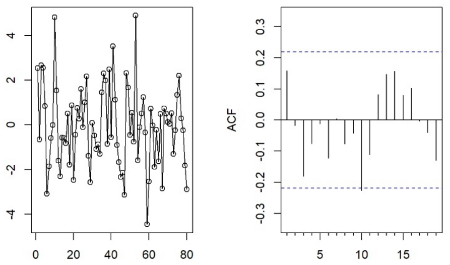
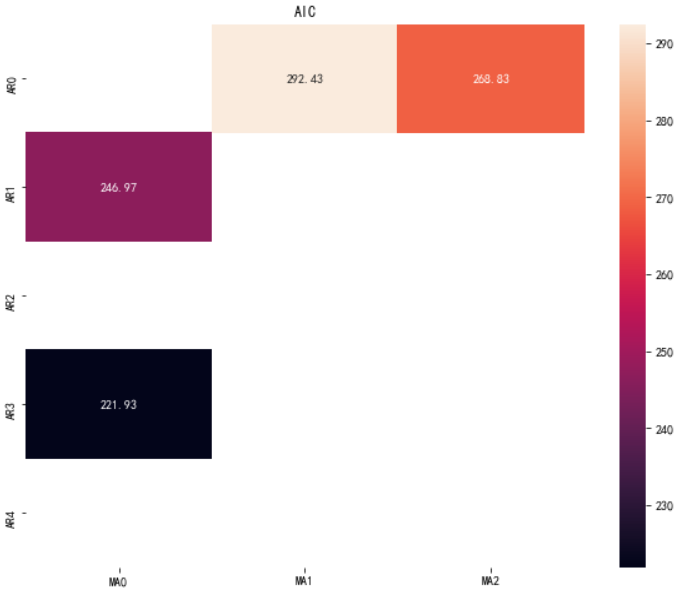

# 时间序列


时间序列是通过以往数据对未来预测的一种方法


区别于**回归**，时间序列必须以时间为索引


因为时间为索引，就拥有了好多专门以时间为基准的各种处理方式


# 研究生报名时间序列分析


我们从研招网上找点现成的数据测试一下


研招网: https://yz.chsi.com.cn/


*基本上各种数据都可以按照这个格式*


# 数据


## 收集数据


我们收集数据保存一个xls


## 整理数据


注意，数据一定要设定特有的格式


比如，时间要设置时间日期格式


数值的部分也设置成数值格式


## 数据模型分析


现在只用《数据模型分析》的知识就可以看见我们的数据结构


纯用xls就可以作图以及回归


> 2019年数据和2020年数据我也补上了，但是2020年的数据只能是猜测，因为2021年中才能有官方数据


# 为什么要做时间序列分析


其实很多数据都是关联性很强的，有了之前的数据可以预测未来的数据


虽然有人表示，**外部因素**很多，预测价值不大


但是要知道，大部分数据有外部因素的影响，也有内部的决定性因素


我们找到内部的决定性数据做预测不就可以了吗？


我们做点什么总会比完全听天由命好得多！


# 时间序列


现在开始时间序列分析


本程序源码


github: https://github.com/thales-ucas/postgrad.git


gitee: https://gitee.com/thales-ucas/postgrad.git


jupyter: https://gitee.com/thales-ucas/postgrad/blob/main/ts.ipynb
> 如果手机观看，请改成电脑格式

# 准备


首选准备工具和选择语言


## 开发工具


我们使用的是python3.8


库用的是statsmodels


官网 https://www.statsmodels.org/stable/index.html


其他的库 pandas、numpy、matplotlib之类不多说


## 其他选择


stata可能对不懂代码的人更简单，但是我毕竟更喜欢Python


https://www.stata.com/


# 数据处理


读取数据，并把‘年份’作为index


```py
import pandas as pd # 加载pandas库
df = pd.read_excel('./postgrad.xlsx', index_col='年份') # 读取数据，并把‘年份’作为index
```


参数df里面将会是下面的数据


```
报名人数（万人）	录取人数（万人）
年份		
1994年	11.4	4.2
1995年	15.5	4
1996年	20.4	4.7
1997年	24.2	5.1
1998年	27.4	5.8
1999年	31.9	7.2
2000年	39.2	10.3
2001年	46	13.3
2002年	62.4	16.4
2003年	79.7	22
2004年	94.5	27.3
2005年	117.2	31
2006年	127.12	34.2
2007年	128.2	36.1
2008年	120	38.6
2009年	124.6	44.9
2010年	140.6	47.44
2011年	151.1	49.46
2012年	165.6	51.7
2013年	176	54.09
2014年	172	54.87
2015年	164.9	57.06
2016年	177	58.98
2017年	201	72.22
2018年	238	76.25
2019年	290	70
2020年	341	111.4
```


pandas自动就提供了画图


```py
import matplotlib.pyplot as plt # 加载matplotlib库
plt.rcParams['font.family'] = ['SimHei'] # 用来解决画图不显示中文的问题
plt.rcParams['axes.unicode_minus'] = False # 

df.plot()
```


只用调用plot函数，自动就会生成图


*所以说，数据几乎不用处理*


# 自相关


这个是时间序列的最重要的部分


自相关函数（Autocorrelation Function）简称acf


> 自相关（英语：Autocorrelation），也叫序列相关，是一个信号于其自身在不同时间点的互相关。非正式地来说，它就是两次观察之间的相似度对它们之间的时间差的函数。它是找出重复模式（如被噪声掩盖的周期信号），或识别隐含在信号谐波频率中消失的基频的数学工具。它常用于信号处理中，用来分析函数或一系列值，如时域信号。
> Zovko, Ilija I. Topics in Market Microstructure. Amsterdam University Press. 2008-09-01. ISBN 9789056295387 


其实是非常多的公式


- 在统计学上，自相关被定义为，两个随机过程中不同时刻的数值之间的皮尔森相关(Pearson correlation).


$R(s, t) = \frac{\Epsilon\left[\left(X_s-\mu_s\right)\left(X_t-\mu_t\right)\right]}{\sigma_s\sigma_t}$


- 如果X为广义平稳过程，则$x_t$的期望$\mu_t$以及标准差$\sigma_t$不随时间t变化，则自相关函数可以表示为时间延迟$\tau$的函数，如下


$R(\tau) = \frac{E[(X_t-\mu)(X_{t+\tau}-\mu)]}{\sigma^2}$


- 信号处理


$R_f(\tau) = f(\tau) \times f^*(-\tau)$


$R_f(\tau) = f(\tau) \times f^*(-\tau) = \int_{-\infty}^{\infty}f(t+\tau)f^*(t)dt$


$R_f(\tau) = f(\tau) \times f^*(-\tau) = \int_{-\infty}^{\infty}f(t+\tau)f^*(t)\,dt = \int_{-\infty}^{\infty}f(t)f^*(t - \tau)\,dt$


其中“\*”是卷积算符，$(\cdot)^*$为取共轭。


同一时间函数在瞬时t和t+a的两个值相乘积的平均值作为延迟时间t的函数，它是信号与延迟后信号之间相似性的度量。延迟时间为零时，则成为信号的均方值，此时它的值最大。


简而言之，自相关函数是表达信号和它的多径信号的相似程度。一个信号经过类似于反射、折射等其它情况的延时后的副本信号与原信号的相似程度。


> 百度百科: https://baike.baidu.com/item/%E8%87%AA%E7%9B%B8%E5%85%B3%E5%87%BD%E6%95%B0/9851266?fromtitle=ACF&fromid=10911147#viewPageContent


但是我们的工具已经集成好了


```py
from statsmodels.tsa import stattools # 加载统计工具
stattools.acf(df['报名人数（万人）']) # 使用acf函数查看自相关，这块必须把数据单独处理
```


直接可以得到数据


```
array([ 1.        ,  0.81423905,  0.65027144,  0.52544157,  0.4328871 ,
        0.36415266,  0.3069205 ,  0.23352341,  0.14151236,  0.05541858,
       -0.01477011, -0.07164203, -0.09999569, -0.12142532, -0.16265738,
       -0.22333888, -0.28665141, -0.32811461, -0.35836546, -0.36852085,
       -0.35864085, -0.34768165, -0.33612065, -0.31564578, -0.28059369,
       -0.2219345 , -0.12826781])
```


数据是否看着不那么直观呢？我们画个图看看


```py
from statsmodels.graphics import tsaplots # 加载画图工具
tsaplots.plot_acf(df['报名人数（万人）'])
```


从图上就很好看出来了


由自相关图可以看出，在3阶后落区间内，衰减缓慢，应该属于不太平稳，有趋势，有震荡。


什么你看不出来？


那么我们来几个参考把


# acf特征图示例


## 平稳序列：ACF衰减迅速


1. 纯随机序列





2. 短期自相关


## 交替序列：ACF交替


## 非平稳序列：ACF衰减缓慢，时间序列有明显的趋势


1. 确定性趋势


2. 随机趋势


3. ACF有周期性：时间序列有周期性、季节性


# 偏自相关


> 百度百科: https://baike.baidu.com/item/%E5%81%8F%E8%87%AA%E7%9B%B8%E5%85%B3%E5%87%BD%E6%95%B0


```py
tsaplots.plot_pacf(df['报名人数（万人）'], lags=12)
stattools.pacf(df['报名人数（万人）'], nlags=12)
```


我们可以得到数据


```
array([ 1.        ,  0.84555593, -0.04445655,  0.0298257 ,  0.03462791,
        0.034026  ,  0.00759744, -0.11156674, -0.16717121, -0.11336622,
       -0.09277878, -0.10712055,  0.00642539])
```


以及图像


# 截尾与拖尾

截尾是指时间序列的自相关函数（ACF）或偏自相关函数（PACF）在某阶后均为0的性质（比如AR的PACF）；拖尾是ACF或PACF并不在某阶后均为0的性质（比如AR的ACF）。


* 截尾：在大于某个常数k后快速趋于0为k阶截尾
* 拖尾：始终有非零取值，不会在k大于某个常数后就恒等于零(或在0附近随机波动)


# 另一个数据也做一下acf和pacf


## acf


```py
tsaplots.plot_acf(df['录取人数（万人）'])
stattools.acf(df['录取人数（万人）'])
```


数据


```
array([ 1.        ,  0.77745446,  0.71290617,  0.61195236,  0.49081891,
        0.40856984,  0.32298534,  0.24185082,  0.15689749,  0.07291436,
       -0.00364409, -0.07209778, -0.14247035, -0.19387783, -0.24183538,
       -0.28991875, -0.32549654, -0.35546734, -0.37584055, -0.37855467,
       -0.3717302 , -0.35881287, -0.33374554, -0.30149915, -0.24478533,
       -0.18128372, -0.12528963])
```


图像


## pacf


```py
tsaplots.plot_pacf(df['录取人数（万人）'])
stattools.pacf(df['录取人数（万人）'])
```


数据


```
array([ 1.        ,  0.80735655,  0.33923726,  0.01240133, -0.17627036,
       -0.04424238, -0.02276105, -0.05906105, -0.14144766, -0.16522976,
       -0.14283129, -0.12345627, -0.20825935])
```


图像


录取人数跟报名人数类似，不太平稳，有趋势，有震荡。


# 单位根检验

* 是平稳性检验的特殊方法。单位根检验是建立ARMA模型、ARIMA模型、变量间的协整分析、因果关系检验等的基础。
* 单位根检验统计检验方法有ADF检验、PP检验、NP检验。最常用的是ADF检验。
* 无法区分哪个是自变量，哪个是因变量，需要对所有的变量做检验。
* 有不平稳的转化为平稳，后续的操作是针对平稳序列做的以下检验。


## ADF检验


Augmented Dickey-Fuller test，ADF是 Dickey-Fuller检验的增广形式。


DF检验只能应用于一阶情况，当序列存在高阶的滞后相关时，可以使用ADF检验，所以说ADF是对DF检验的扩展。


1. ADF检验的原理


ADF检验就是判断序列是否存在单位根：如果序列平稳，就不存在单位根；否则，就会存在单位根。


2. ADF检验的假设


H0 假设就是存在单位根，如果得到的显著性检验统计量小于三个置信度（10%，5%，1%），则对应有（90%，95，99%）的把握来拒绝原假设。


> 百度百科: https://baike.baidu.com/item/%E5%8D%95%E4%BD%8D%E6%A0%B9%E6%A3%80%E9%AA%8C


创建一个dickey函数，后面使用


```py
def dickey(df):
    t = stattools.adfuller(df)
    output = pd.DataFrame(index=['Test Statistic Value', "p-value", "Lags Used", "Number of Observations Used","Critical Value(1%)","Critical Value(5%)","Critical Value(10%)"],columns=['value'])
    output['value']['Test Statistic Value'] = t[0]
    output['value']['p-value'] = t[1]
    output['value']['Lags Used'] = t[2]
    output['value']['Number of Observations Used'] = t[3]
    output['value']['Critical Value(1%)'] = t[4]['1%']
    output['value']['Critical Value(5%)'] = t[4]['5%']
    output['value']['Critical Value(10%)'] = t[4]['10%']
    return output
```

## 报名人数检验


条款 | 值
--- | ---
Test Statistic Value |	1.332336
p-value	| 0.996784
Lags Used |	2
Number of Observations Used |	24
Critical Value(1%) |	-3.737709
Critical Value(5%) |	-2.992216
Critical Value(10%) |	-2.635747

分析一下该序列能否平稳：


1%、%5、%10不同程度拒绝原假设的统计值和ADF Test result的比较，ADF Test result同时小于1%、5%、10%即说明非常好地拒绝该假设，本数据中，adf结果（Test Statistic）为1.332336， 大于三个level的统计值(-3.737709, -2.992216, -2.635747)。


看P-value是否非常接近0. 本数据中，P-value 为 0.996784,不够接近0。


ADF检验的原假设是存在单位根，只要这个统计值是小于1%水平下的数字就可以极显著的拒绝原假设，认为数据平稳。注意，ADF值一般是负的，也有正的，但是它只有小于1%水平下的才能认为是及其显著的拒绝原假设。


对于ADF结果在1% 以上 5%以下的结果，也不能说不平稳，关键看检验要求是什么样子的。


但是对于本例，数据是显然不平稳的了。


## 录取人数检验


条款 | 值
--- | ---
Test Statistic Value |	0.833342
p-value	| 0.992156
Lags Used |	3
Number of Observations Used |	23
Critical Value(1%) |	-3.752928
Critical Value(5%) |	-2.9985
Critical Value(10%) |	-2.638967


录取人数的数据一样不平稳


# 一阶差分


要让数据平稳才好做预测，所以我们使用一阶差分


一阶差分就是离散函数中连续相邻两项之差。


> 百度百科: https://baike.baidu.com/item/%E4%B8%80%E9%98%B6%E5%B7%AE%E5%88%86


## 报名人数


```py
signdiff = pd.DataFrame()
signdiff['一阶差分'] = df['报名人数（万人）'].diff().dropna()
signdiff.plot()
dickey(signdiff['一阶差分'])
```


条款 | 值
--- | ---
Test Statistic Value |	-1.731451
p-value	| 0.414985
Lags Used |	1
Number of Observations Used |	24
Critical Value(1%)	| -3.737709
Critical Value(5%)	| -2.992216
Critical Value(10%)	| -2.635747


还是不够平稳


## 录取人数


```py
enrolldiff = pd.DataFrame()
enrolldiff['一阶差分'] = df['录取人数（万人）'].diff().dropna()
enrolldiff.plot()
dickey(enrolldiff)
```


条款 | 值
--- | ---
Test Statistic Value |	-3.094678
p-value	| 0.02695
Lags Used |	9
Number of Observations Used |	15
Critical Value(1%)	| -3.964443
Critical Value(5%)	| -3.084908
Critical Value(10%)	| -2.681814


录取人数一阶差分之后p-value小于0.05了，达到显著水平


# 高阶差分


我们可以继续做高阶差分


## 二阶

```py
signdiff['二阶差分'] = df['报名人数（万人）'].diff(periods=2)
signdiff = signdiff.dropna()
signdiff.plot()
dickey(signdiff['二阶差分'])
```


条款 | 值
--- | ---
Test Statistic Value |	-0.33767
p-value	| 0.919997
Lags Used |	4
Number of Observations | Used	20
Critical Value(1%)	| -3.809209
Critical Value(5%)	| -3.021645
Critical Value(10%)	| -2.650713


做了二阶差分依然不够显著


## 三阶


```py
signdiff['三阶差分'] = df['报名人数（万人）'].diff(periods=3)
signdiff = signdiff.dropna()
signdiff.plot()
dickey(signdiff['三阶差分'])
```


条款 | 值
--- | ---
Test Statistic Value |	-3.642791
p-value	| 0.004994
Lags Used |	1
Number of Observations | Used	22
Critical Value(1%) |	-3.769733
Critical Value(5%)	| -3.005426
Critical Value(10%)	| -2.642501


三阶差分终于平稳了


但是差分太多，可能数据没有意义了，预测准确度虽然低，可能还是要用原始的数据


# 获取最佳pq


我们在p=0、1、2、3、4和q=0、1、2中做对比


这时候画一个热力图效果很好


热力图函数


```py
import numpy as np
from statsmodels.tsa import arima_model
import itertools
import seaborn as sns #热力图
import warnings
warnings.filterwarnings("ignore")
def thermodynamicOrder(df, ar=4, ma=2):
    results_aic = pd.DataFrame(\
        index=['AR{}'.format(i) for i in range(0, ar+1)],\
        columns=['MA{}'.format(i) for i in range(0, ma+1)])
    for p, q in itertools.product(range(0, ar+1), range(0, ma+1)):
        if p==0 and q==0:
            results_aic.loc['AR{}'.format(p), 'MA{}'.format(q)] = np.nan
            continue
        try:
            results = arima_model.ARMA(df, (p, q)).fit()
            #返回不同pq下的model的BIC值
            results_aic.loc['AR{}'.format(p), 'MA{}'.format(q)] = results.aic
        except:
            continue
    results_aic = results_aic[results_aic.columns].astype(float)
    fig, ax = plt.subplots(figsize=(10, 8))
    ax = sns.heatmap(results_aic,
                    #mask=results_aic.isnull(),
                    ax=ax,
                    annot=True, #将数字显示在热力图上
                    fmt='.2f',
                    )
    ax.set_title('AIC')
    plt.show()
```


## 报名人数热力图





> 可以得到p=3，q=0 效果最好


## 录取人数热力图


> 可以得到p=2，q=0 效果最好


# 模型预测


周期性不强，我们使用ARMA模型


一阶差分的要还原


```py
def revert(diffValues, *lastValue):
    for i in range(len(lastValue)):
        result = []
        lv = lastValue[i]
        for dv in diffValues:
            lv = dv + lv
            result.append(lv)
        diffValues = result
    return diffValues
```


预测未来数据


```py
fig, ax = plt.subplots(figsize=(15, 6))
df.plot(ax=ax)
signarma = arima_model.ARMA(df['报名人数（万人）'], (3, 0)).fit()
signfuture = pd.DataFrame({'报名模型': signarma.fittedvalues}, index=signarma.fittedvalues.index)
signfuture = signfuture.append(pd.DataFrame({'报名模型': signarma.forecast(4)[0]}, index=['2021年','2022年','2023年','2024年']))
signfuture.plot(ax=ax)
enrollarma = arima_model.ARMA(enrolldiff['一阶差分'], (2, 0)).fit()
enrollfuture = pd.DataFrame({'录取模型': revert(enrollarma.fittedvalues, df['录取人数（万人）'][0])}, index=enrollarma.fittedvalues.index)
enrollfuture = enrollfuture.append(pd.DataFrame({'录取模型':revert(enrollarma.forecast(5)[0], df['录取人数（万人）'][-2])}, index=['2020年','2021年','2022年','2023年','2024年']))
enrollfuture.plot(ax=ax)
```


我们看看未来的数据怎样把~


时间    |  报名预测
--- |   ---
2021年  |   386.760535
2022年	|   425.996818
2023年	|   458.785991
2024年	|   485.769711


时间    |  录取预测
--- |   ---
2020年  |	69.985935
2021年	|   76.769525
2022年	|   81.898363
2023年	|   83.108294
2024年	|   84.263803