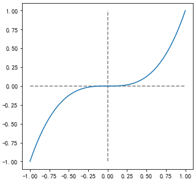
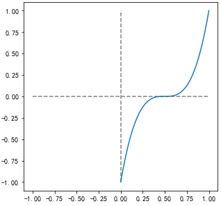
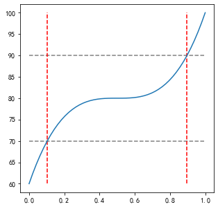
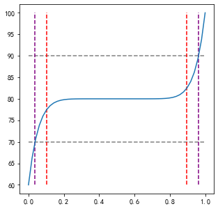

# 考研复试通过率


考研复试了，我们尝试用数学方法算一下你的上岸成功率


## 概率


比如招生12人，初试上线的总共20人


按照概率，总共有$C_{20}^{12}$种可能性


你上线，就是把你专门拿出来剩下的再组合一下，就是$C_{19}^{11}$种可能性


所以你的上岸成功率是$\frac{C_{19}^{11}}{C_{20}^{12}}=\frac{19\times18\times...\times11}{20\times19\times...\times12}=\frac{11}{20}=55\%$


但是这样是不对的，因为不是随机取，是有权重的！就是初试成绩


# 复试分析


## 占比


一个人初试成绩350，复试占比50%，比如复试成绩是75，那么——


$50\times\frac{350}{500} + 50\times\frac{75}{100} = 72.5$


> 也许有的学校的复试占比不一样，那么就要改一下各个参数


## 分值分布


复试的分数，基本在60 ~ 100之间，基本不会有60以下，但是大部分应该都在中间的70 ~ 80，60多和90多都比较少


所以分布图应该是一个奇函数的幂函数


f(x) = x^3^





> 这样可以保障平均分布的x会产生y的正负极值分布都会少一些


我们需要把函数做一定处理，首先，要搞成0 ~ 1的函数分布，方便使用random随机


f(x) = (2x - 1)^3^





> 定义域可以之后取0 ~ 1了


我们要把y值固定在在60 ~ 100


得到函数——

f(x) = 20(2x - 1)^3^ + 60





> 从图中可以看出来，70以下很少，90以上也很少


如果觉得还是多，可以继续增大函数的幂


比如——


f(x) = 20(2x - 1)^9^ + 60





> 可以看到紫色的线，对比红色的线，范围更少了


我们写一个函数，专门输入初试成绩，可以随机获得最终分数


```py
import random
def aggregate(score):
    x = random.random()
    y = ((x*2 - 1) ** 3)*20 + 80
    return 50 * (score/500) + 50 * (y/100)
```


我们试试看初试350分


```py
aggregate(350)
```


多试几次看结果


```
74.99852414320696
81.45032134393863
73.09044610824242
83.15058028025783
75.82464128224818
69.43091475827083
74.4028400901793
```


# 随机统计验证


我们回到最开始——


1. 招生12人
2. 上线20人
3. 小明(某人)初试分数350
4. 初试排名14


也就是说，小明需要复试之后排名在12以上(含)才能上岸


我们来做一下模拟，看看概率


## 类


```py
import pandas as pd
class Aggregate:
    def __init__(self):
        pass
    def preliminary(self, xls, id, rank):
        """
        初试成绩
        xls 成绩表
        id  参考人id
        rank    录取名次
        """
        self.df = pd.read_excel(xls)
        self.id = id
        self.rank = rank
    def reexam(self, seed=1):
        """
        模拟复试分数
        """
        random.seed(seed)
        self.df['复试'] = self.df['分数'].map(lambda x:((random.random()*2 - 1) ** 3)*20 + 80)
        self.df['总分'] = 50 * (self.df['分数']/500) + 50 * (self.df['复试']/100)
        self.df = self.df.sort_values(by="总分", ascending=False)
        return self.df
    def sim(self):
        """
        模拟
        """
        enroll = 0
        times = 500
        for n in range(1, times):
            df = self.reexam(n)
            target = df[df['编号'] == self.id]
            rank = df[df['总分'] > target['总分'].values[0]]
            if rank.count()[0] <= 12:
                enroll += 1
        return enroll / times
```


## 小明的上岸成功率


我们初试化类之后，载入分数列表，设置小明的id，以及录取人数


```py
agg = Aggregate()
agg.preliminary('./preliminary.xlsx', 10014, 12)
agg.df
```


我们读取了preliminary.xlsx文件，设置10014为小明的编号，总共录取12人


我们可以先看一下数据


```
编号	分数
0	10001	400
1	10002	381
2	10003	380
3	10004	376
4	10005	373
5	10006	372
6	10007	370
7	10008	362
8	10009	361
9	10010	359
10	10011	353
11	10012	351
12	10013	350
13	10014	350
14	10015	350
15	10016	349
16	10017	349
17	10018	348
18	10019	348
19	10020	348
```


看看结果吧


```
agg.sim()
```


结果是0.524，也就是说小明的上线概率是52.4%


## 第一名的上岸成功率


```py
agg = Aggregate()
agg.preliminary('./preliminary.xlsx', 10001, 12)
agg.sim()
```


结果是89.6%


## 最后一名的上岸成功率


```py
agg = Aggregate()
agg.preliminary('./preliminary.xlsx', 10020, 12)
agg.sim()
```


结果是42.4%


## 总结


1. 落后2名，小明之后一半几率上岸
2. 第一名也不是100%上岸，只有8成把握
3. 最后一名逆袭成功率也不低


总得来说，希望大家重视复试


最后祝今年考研的童鞋顺利上岸